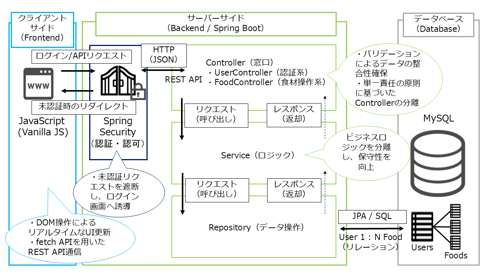

# スマート冷蔵庫管理システム (Smart Refrigerator Manager)

食材の消費期限を可視化し、食品ロスを削減するための在庫管理アプリケーションです。  
今回のアップデートにより、**マルチユーザー対応とセキュリティ基盤**を構築し、より実用的なシステムへと進化させました。

## 1. プロジェクト概要
日常の「冷蔵庫の中身を忘れてしまう」「期限切れで捨ててしまう」という課題を解決するために開発しました。
単なるリスト作成ではなく、**「個人ごとのアカウント管理」**、**「期限に応じたアラート表示」**、**「リアルタイム検索」**により、安全で直感的な在庫管理を実現しています。

## 2. 使用技術 (Tech Stack)
実務を想定し、セキュリティと保守性を重視した標準的な構成を採用しています。

| 分類 | 技術スタック |
| :--- | :--- |
| **Backend** | Java 17 / Spring Boot 3.x / **Spring Security** |
| **Frontend** | JavaScript (Vanilla JS) / HTML5 / CSS3 |
| **Database** | MySQL 8.x |
| **ORM** | Spring Data JPA |
| **Build Tool** | Maven |
| **Authentication** | BCrypt (Password Hashing) |

## 3. システムアーキテクチャ
メンテナンス性と堅牢性を重視し、**Spring Securityを組み込んだ3層アーキテクチャ**を採用しています。

  

* **Spring Security**: 認証・認可の門番。未認証リクエストを遮断し、ログイン画面へ制御。
* **Controller**: **単一責任の原則**に基づき、ユーザー管理（User）と食材操作（Food）の窓口を分離。
* **Service**: ビジネスロジックの集約。ログインユーザーに紐づくデータのみを抽出するフィルタリング論理を実装。
* **Repository**: JPAを活用したDB操作。UserとFoodの**1対多（1:N）リレーション**を管理。

## 4. こだわったポイント・機能

### ✅ 堅牢なセキュリティとマルチユーザー対応
* **認証・認可基盤**: Spring Securityを導入。パスワードはBCryptでハッシュ化して保存し、安全なログイン機能を実装。
* **個別データ管理**: ログインユーザーのIDに基づき、自分自身の冷蔵庫データのみを表示・操作できる環境を構築。

### ✅ 責務を明確にしたコード設計
* **Controllerの分離**: 認証状態の確認用API（`/api/auth/status`）を `UserController` へ集約するなど、コードの保守性と見通しを向上。
* **RESTfulなAPI設計**: フロントエンド（Vanilla JS）とバックエンド（Spring Boot）を明確に分離し、非同期通信によるスムーズな操作感を実現。

### ✅ ユーザー体験の向上 (UX)
* **動的な期限アラート**: 残り日数に応じて行の色を変化させ、消費の優先順位を視覚的に提示。
* **カレンダー入力の最適化**: 日付入力欄のどこをクリックしてもカレンダーが表示されるようCSSを調整し、入力の手間を軽減。

## 5. 課題解決のエピソード
開発中、異なるエンティティ（UserとFood）間での相互参照による「循環参照エラー」や、ログイン後のリダイレクト制御の不備に直面しました。

* **問題**: ログアウト後に一瞬だけ認証が必要な画面が表示されてしまう現象が発生。
* **解決**: `SecurityConfig` のログアウト成功時の遷移先（`logoutSuccessUrl`）を、トップページではなく明確にログイン画面（`/login`）に指定することで解決。
* **学び**: フレームワークのライフサイクルと、HTTPリクエストの流れを正確に把握することの重要性を痛感しました。

## 6. 開発プロセス：AIとのペアプログラミング
本プロジェクトでは、ChatGPTを**「技術顧問」**として迎え、開発を推進しました。

> [!IMPORTANT]
> **AI活用における私のポリシー**
> 「提示されたコードを単に写す」ことはせず、**「なぜこの設計（3層構造）にするのか」「なぜこのセキュリティ設定が必要なのか」**を徹底的に議論し、全コードの意図を説明できる状態で実装しています。

* **設計のブラッシュアップ**: 循環参照の回避策や、セキュリティ設定のベストプラクティスについて議論を重ね、品質を向上。
* **デバッグ能力の向上**: 複雑なエラーログをAIと共に解析し、原因（型不一致や設定ミス）を特定するプロセスを通じて、解決速度を早めました。

## 7. 今後の展望
* 現在はAPI形式ですが、今後はこれをベースにReactを用いたモダンなUIへの刷新や、Junitによる単体テストの自動化を検討しています。