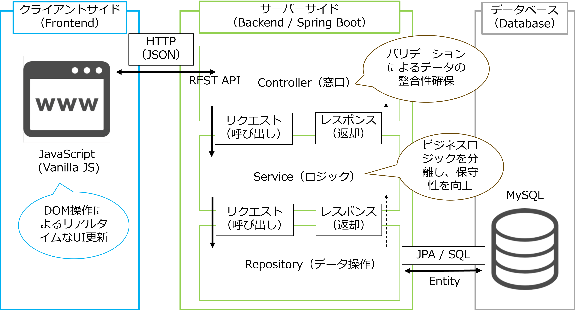

# スマート冷蔵庫管理システム (Smart Refrigerator Manager)

食材の消費期限を可視化し、食品ロスを削減するための在庫管理アプリケーションです。

## 1. プロジェクト概要
日常の「冷蔵庫の中身を忘れてしまう」「期限切れで捨ててしまう」という課題を解決するために開発しました。
単なるリスト作成ではなく、**「期限までの残り日数に応じたアラート表示」**や**「リアルタイム検索」**により、直感的な在庫管理を実現しています。

## 2. 使用技術 (Tech Stack)
実務を想定し、モダンなJava開発の標準的な構成を採用しています。

| 分類 | 技術スタック |
| :--- | :--- |
| **Backend** | Java 17 / Spring Boot 3.x |
| **Frontend** | JavaScript (Vanilla JS) / HTML5 / CSS3 |
| **Database** | MySQL 8.x |
| **ORM** | Spring Data JPA |
| **Build Tool** | Maven |
| **Validation** | Jakarta Bean Validation |

## 3. システムアーキテクチャ
メンテナンス性と拡張性を重視し、**3層アーキテクチャ**を採用しています。

  

* **Controller**: REST APIの窓口。リクエストの制御とバリデーションを担当。
* **Service**: **ビジネスロジックの集約**。データの加工や保守性の向上を担当。
* **Repository**: JPAを活用したデータベース操作の抽象化。

## 4. こだわったポイント・機能

### ✅ 二段構えのバリデーション
ユーザーの利便性とデータの整合性を両立させるため、以下の2段階でチェックを行っています。
* **フロントエンド**: JavaScriptによるリアルタイムな入力チェック（無駄な通信の削減）。
* **バックエンド**: `jakarta.validation` を用いたサーバー側での型・論理チェック（不正データの完全排除）。

### ✅ ユーザー体験の向上 (UX)
* **動的な期限アラート**: 残り日数に応じて行の色を変化させ、消費の優先順位を視覚的に提示。
* **インクリメンタルサーチ**: ページ遷移なしで、入力のたびに即座に検索結果をフィルタリング。

## 5. 課題解決のエピソード
開発中、日付型（`LocalDate`）に対するバリデーションの実装において、アノテーションとデータ型の不一致によるエラーに直面しました。

* **問題**: `LocalDate`型に `@NotBlank` を使用し、バリデーターが見つからないエラーが発生。
* **解決**: エラーメッセージを深く分析し、文字列用の `@NotBlank` ではなく、オブジェクト用の `@NotNull` が適切であることを特定・修正。
* **学び**: ライブラリの仕様を公式ドキュメント等で正確に確認し、適切な型を選択する重要性を学びました。

## 6. 開発プロセス：AIとのペアプログラミング
本プロジェクトでは、ChatGPTを**「シニアエンジニアとのペアプログラミング」**のパートナーに見立てて開発を行いました。単なるツール利用ではなく、**「技術的な意図の言語化」**に重点を置いています。

> [!IMPORTANT]
> **AI活用における私のポリシー**
> 「AIが出した答えをそのまま使う」のではなく、**「なぜそのコードが必要なのか」を納得するまで議論する**ことで、自走力を高める開発プロセスを実践しました。

* **設計の妥当性確認**: 3層アーキテクチャのメリットや、各層の責任境界について議論し、保守性の高い設計を選択。
* **徹底的なコード理解**: 提案されたコードに対して「なぜそのメソッドを使うのか」「なぜそのアノテーションが必要なのか」を一つずつ確認し、自分の知識として定着させました。
* **トラブルシューティング**: 発生したエラーに対し、ログを解析してAIと原因を特定するプロセスを繰り返すことで、デバッグ能力を磨きました。

## 7. 今後の展望
* Spring Securityを用いたユーザー認証機能の実装
* LINE Messaging APIと連携した、期限切れ間近の食材のプッシュ通知機能